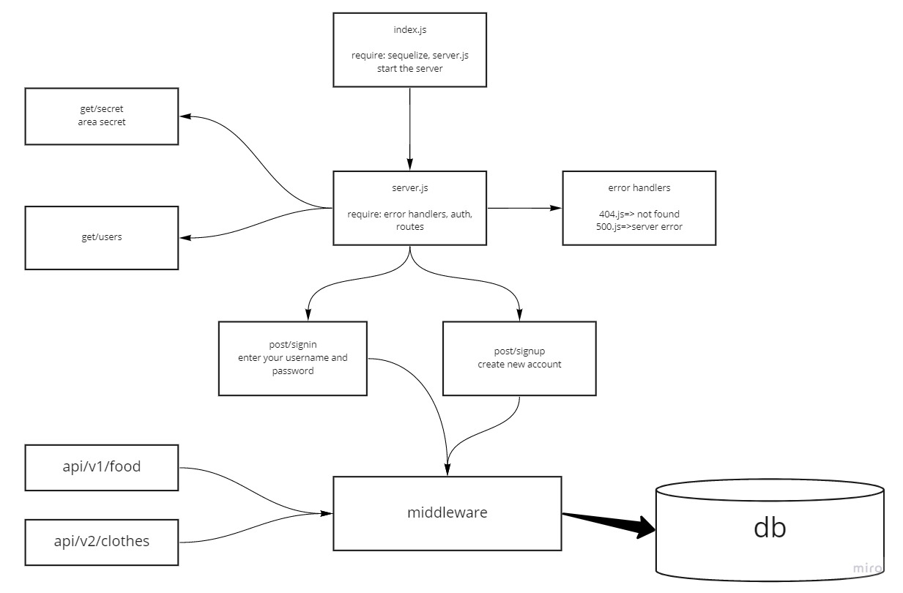

# auth-api

## Author: Saleem Diab

## Links and Resources:
 ### Heroku:
[Heroku](https://authser.herokuapp.com/)

* ### Github Actions:
[actions](https://github.com/saleem-ux/auth-api/actions)

* ### pull request :
[PR](https://github.com/saleem-ux/auth-api/pull/1)

## Dependencies needs to install

### dependencies :

* ### "base-64"
* ### "bcrypt"
* ### "cors"
* ### "dotenv"
* ### "express"
* ### "jsonwebtoken"
* ### sequelize 
* ### sqlite3
* ### pg
* ### "morgan"

### devDependencies :

* ### eslint"
* ### "jest"
* ### "supertest"

## Setup 
### .env requirements :
* ### PORT=3000
* ### NODE_ENV=test
* ### SECRET - used to create jwt
* ### DATABASE_URL

## How to initialize/run your application (where applicable)

* ### nodemon - node index.js

* ### Endpoints:
    * ### home route (/)
    * ### for create (/signup)
    * ### for login (/signin)
    * ### for get (/users)
    * ### for get(/api/v1/food)
    * ### for get(/api/v1/food/1)
    * ### for create(/api/v1/food)
    * ### for update(/api/v1/food)
    * ### for delete(/api/v1/food)
    * ### for get(/api/v2/clothes)
    * ### for get(/api/v2/clothes/1)
    * ### for create(/api/v2/clothes)
    * ### for update(/api/v2/clothes)
    * ### for delete(/api/v2/clothes)

 ## Testing

### Run tests with :

### **npm run test**

## UML/Application

